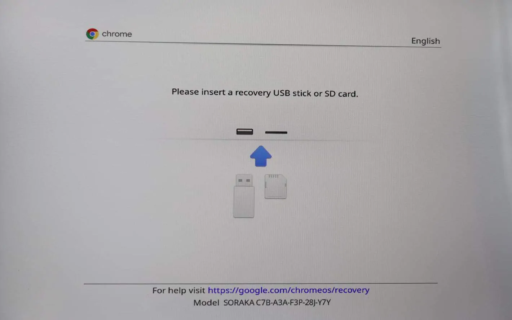

# 크롬북 개발 환경 구축

크롬 OS를 운영체제로 사용하는 클라우드 기반의 컴퓨터

## 크롬 OS

크롬 웹브라우저를 기반으로 한 운영체제로 리눅스 기반의 경량화된 OS

# 개발 환경 구축

## 1. 개발자 모드 설정

### 리커버리(recovery) 모드 진입

전원을 끈 상태에서 `**ESC + Refresh(F3) + Power**` 버튼을 동시에 눌러 리커버리 모드로 진입



                                                                 <리커버리 모드>

### 개발자 전환 모드 진입

리커버리 모드에서 `**Ctrl + D**` 키를 눌러 개발자 전환 모드로 진입


`Enter` 키 입력 후 대기 (약 5분 정도 소요됨)

<aside>
💡 개발자 모드로 전환하고 나면, 이 후 부팅 때 마다
`**OS 확인이 사용 중지되었습니다.**` 라는 문구가 출력됨
이 때 마다 `**Ctrl + D**`를 눌러 시작

</aside>

## 2. 크롬북 설정

### A. 네트워크에 연결

WiFi 연결

### B. 서비스 약관

동의 및 계속

### C. 사용자 설정

나 : 기기를 업무용 또는 개인용으로 설정합니다.

### D. Chromebook에 로그인

구글 계정으로 로그인

### E. Chromebook 동기화

동의 및 계속


### F. Google Play 앱 및 서비스

수락


### G. 휴대전화에 연결

취소


### H. 설정 완료

시작하기


## 3. 크롬 OS 업데이트

화면 좌측 하단의 `**[런처]**` → `**[더보기]**` 클릭


`**[설정]**` 클릭


설정 화면에서 `**[Chrome OS 정보]**` → `**[업데이트]**` → `**[다시 시작]**`


<aside>
💡 `**OS 확인이 사용 중지되었습니다.**` 라는 문구가 출력되면
`**Ctrl + D`** 키를 눌러 시작

</aside>

## 4. Linux 개발 환경 사용 설정

`**[설정]**` → `**[개발자]**` → `**Linux 개발 환경**` → `**[사용]**` 


## 5. Linux 앱 터미널 실행

`**[런처]**` → `**[Linux 앱]**` → `**[터미널]**` 실행


### A. CPU 확인 - 터미널에 아래 명령어 입력

```powershell
cat /proc/cpuinfo
```

### B. OS 확인

```powershell
cat /etc/issue
```

### C. 메모리 확인

```powershell
free -m
```

## 6. VS CODE 설치

**VS CODE 사이트 접속**

[Visual Studio Code - Code Editing. Redefined](https://code.visualstudio.com/)

**.deb 설치 파일 다운로드**


**[내 파일] → [다운로드] → 다운로드한 파일을 더블 클릭하여 설치**


**Linux 앱 설치 창에서 [설치] 클릭**


## 7. VS CODE 실행 & 설정

**[런처] → [Linux 앱] → [Visual Studio Code] 실행**


### A. 작업 디렉토리 생성

**[Explorer] → [Open Folder]**


**[디렉토리 생성] → `works` 입력 → [Create] → [OK]**


### B. 확장 플러그인 설치

**[Extenstions] → `live server` 검색 → [Install] 선택**


